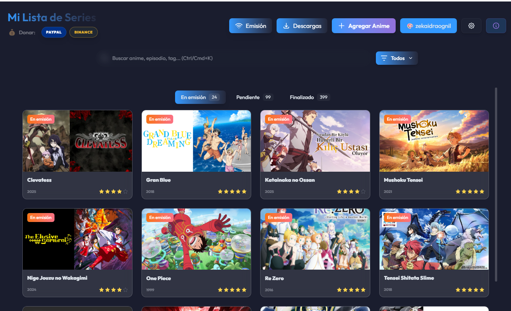
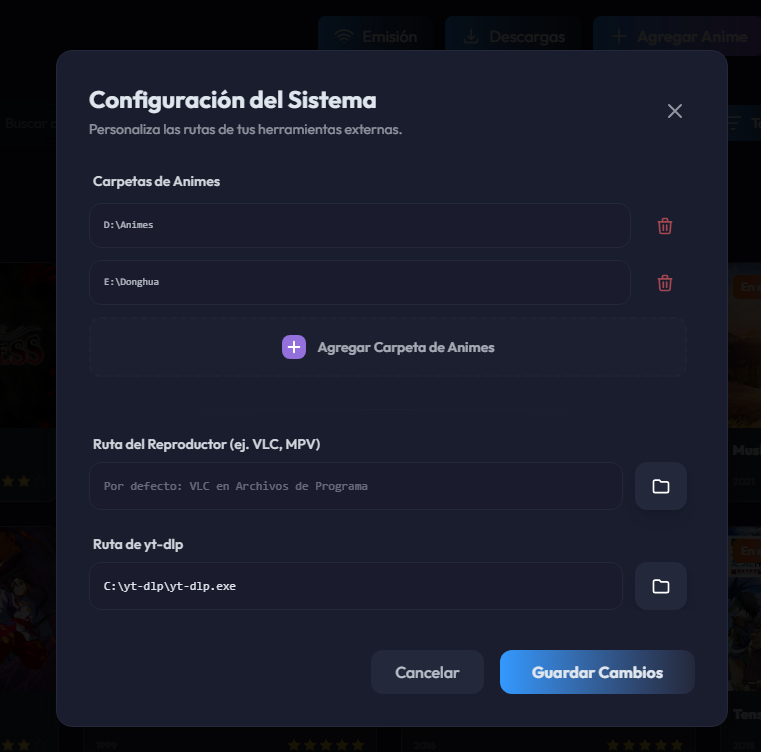
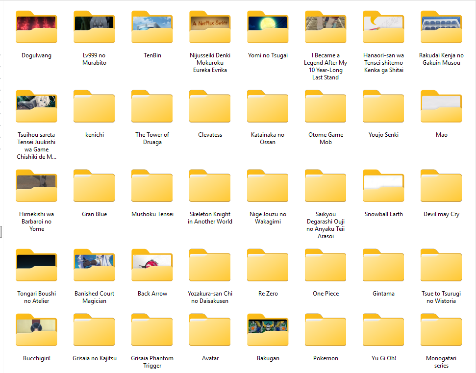
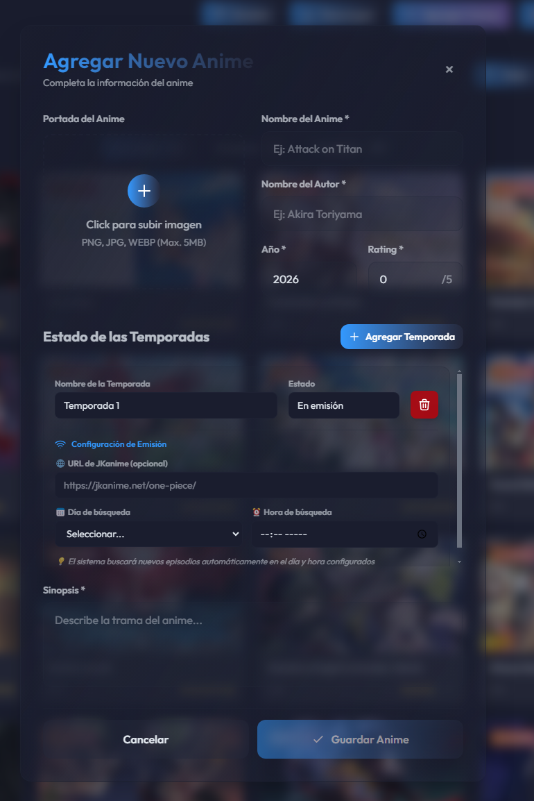
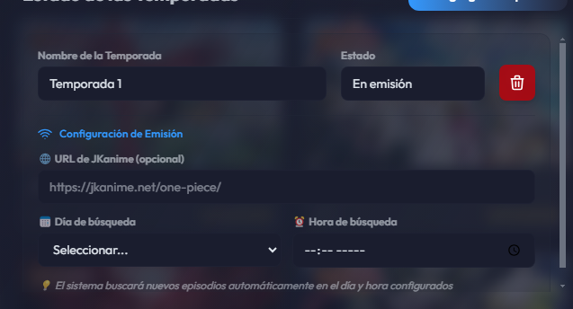
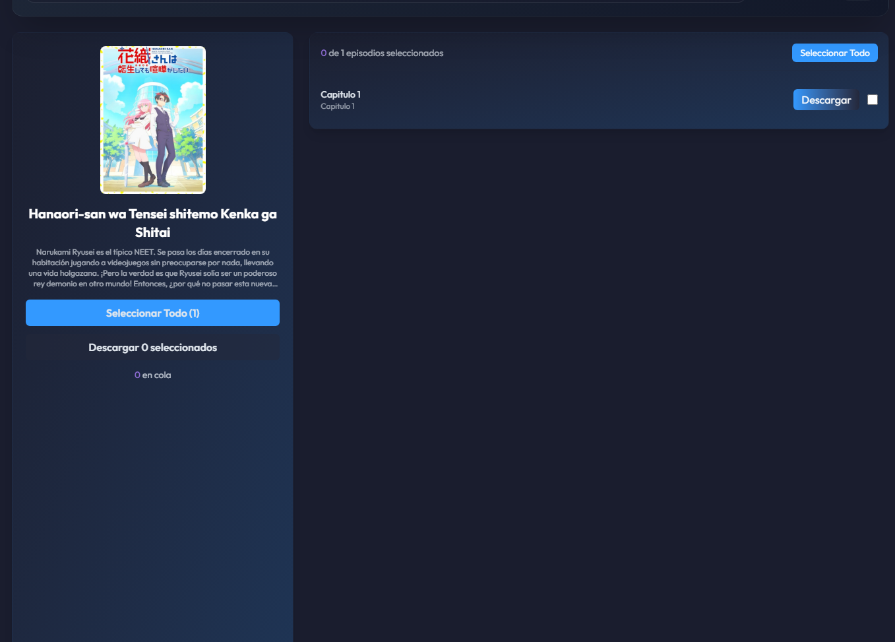

# 🎬 Collection Launcher

**Collection Launcher** es una aplicación de escritorio diseñada para centralizar, organizar y automatizar el seguimiento de tus series y películas almacenadas de forma local. Olvídate de buscar manualmente tus archivos; controla tu biblioteca directamente desde una interfaz moderna e intuitiva.

[

---

## 📸 Vista General

### Panel Principal
El sistema cuenta con un buscador global, filtrado rápido por pestañas de estado (*En emisión*, *Pendiente*, *Finalizado*) y valoración mediante sistema de estrellas.

  

Posee tres módulos clave accesibles desde el panel superior:
*   **Módulo de Emisión:** Muestra rápidamente los capítulos pendientes de estreno.
*   **Módulo de Descargas:** Gestor integrado para encolar y descargar episodios.
*   **Personalización y Temas:** Configuración visual del software con soporte para temas dinámicos.

---

## ⚙️ Paso 1: Configuración del Sistema

Antes de comenzar a añadir tu contenido, abre el panel de configuración pulsando el icono de engranaje (⚙️):

  

1.  **Carpetas de Animes/Series:** Haz clic en **"Agregar Carpeta de Animes"** para seleccionar el directorio raíz donde almacenas tus videos. El sistema leerá de forma automática las carpetas presentes en esta ruta.
2.  **Ruta del Reproductor:** Selecciona el reproductor de video de tu preferencia. Por defecto, el sistema viene preconfigurado para interactuar con **VLC Media Player**.
3.  **Ruta de yt-dlp:** Requisito indispensable para la descarga de episodios. 
    *   Descarga el ejecutable de [yt-dlp](https://github.com/yt-dlp/yt-dlp).
    *   **Consejo:** Coloca el archivo directamente en esta ruta de tu sistema:  
        `C:\yt-dlp\yt-dlp.exe`
    *   Selecciona dicha ruta en el panel de configuración de la app.

---

## 🗂️ Paso 2: Estructura de Archivos y Cómo Añadir Series

Para agregar una serie a la base de datos de manera exitosa, ten en cuenta las siguientes reglas de organización:

### 1. Coherencia en el Nombre de Carpetas
El nombre que asignes al campo **"Nombre del Anime"** dentro del formulario debe coincidir **exactamente** con el nombre de la carpeta física en tu disco duro para que el sistema pueda emparejarlos.

  

### 2. Estructura de Subcarpetas (Máximo 2 niveles)
El sistema soporta hasta un máximo de dos niveles jerárquicos:
*   **Nivel 1 (Carpeta Madre):** `Boku no Hero`
*   **Nivel 2 (Subcarpeta):** `Temporada 2` o `Season 2` (puedes nombrar las subcarpetas de temporadas como prefieras).
*   *Nota:* Si la serie no tiene subcarpetas adicionales, la aplicación tomará por defecto los capítulos directamente desde la carpeta madre.

---

## 📝 Paso 3: Completar el Formulario de Registro

Al pulsar en **"Agregar Anime"**, rellena los datos requeridos por la interfaz:

  

*   **Portada:** Sube una imagen promocional (PNG, JPG, WEBP).
*   **Estado de las Temporadas:** Puedes definir el estado actual del proyecto entre tres opciones:
    *   `En emisión` (ideal para activar el escaneo rápido de novedades).
    *   `Pendiente`.
    *   `Finalizado`.

### ⚡ Integración con Emisión (Scraping de Capítulos)
Si marcas el estado como **En emisión**, habilitarás la sincronización automática de episodios. 

  

*   Actualmente, el sistema cuenta con integración nativa mediante plugin para el portal **JKAnime**.
*   **Configuración:** Simplemente pega el enlace del anime correspondiente en el portal (ejemplo: `https://jkanime.net/nombre-de-la-serie/`).
*   **Frecuencia:** Define el día y la hora en que deseas que el sistema busque actualizaciones de manera automática.

---

## 📥 Módulo de Descargas en Acción

Una vez configurada la serie, el sistema comparará tu carpeta local con los episodios disponibles en línea:

  

*   **Lectura Inteligente:** El sistema detecta qué episodios tienes guardados localmente.
*   **Descarga con un clic:** Abre el modal de la serie para listar los episodios faltantes, selecciónalos y agrégalos a la cola de descargas automática utilizando el motor de `yt-dlp`.

---

## 🚀 Instalación y Uso

1. Dirígete a la sección de [Releases de este repositorio](https://github.com/zekaidragonil/collection-lancher/releases/tag/v1.1.0).
2. Descarga el instalador ejecutable `.exe` de la última versión estable.
3. Instala el programa, realiza la configuración inicial del paso 1 y empieza a disfrutar de tu colección.
